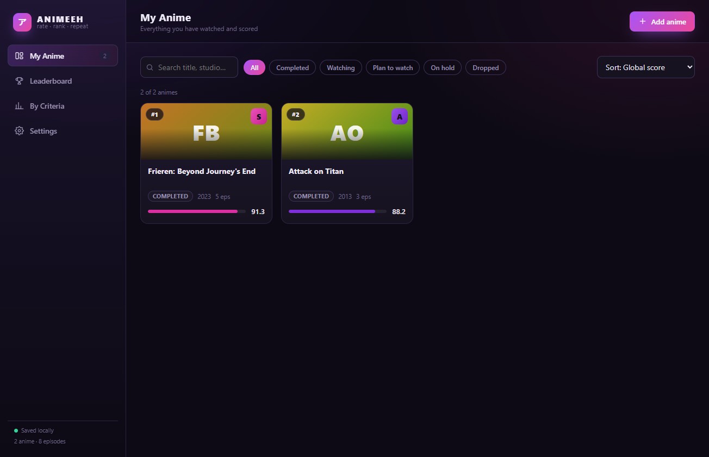
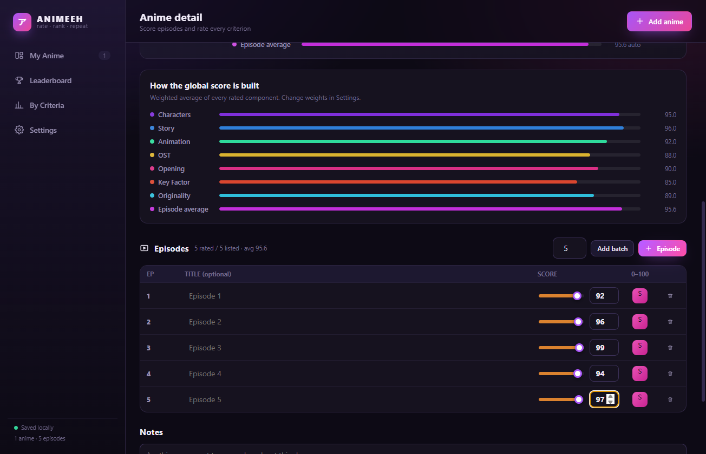
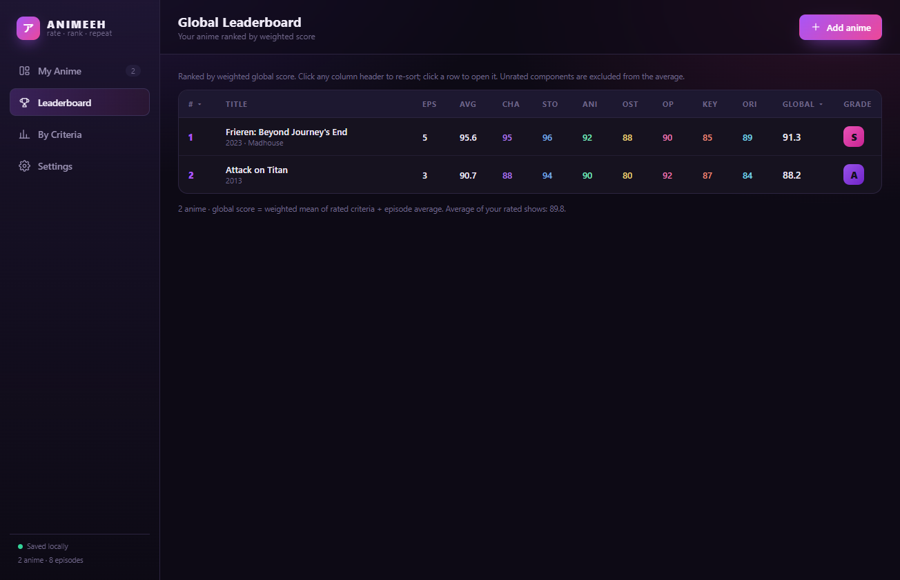
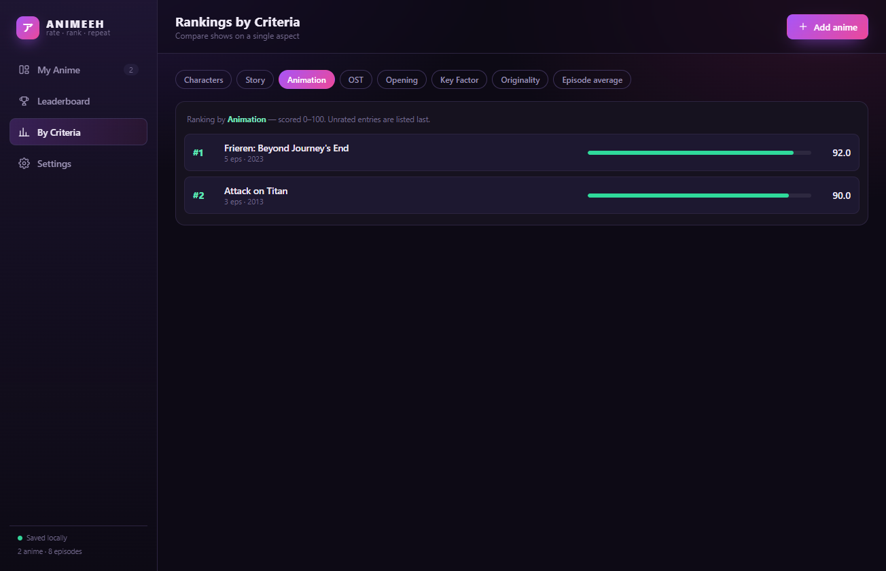
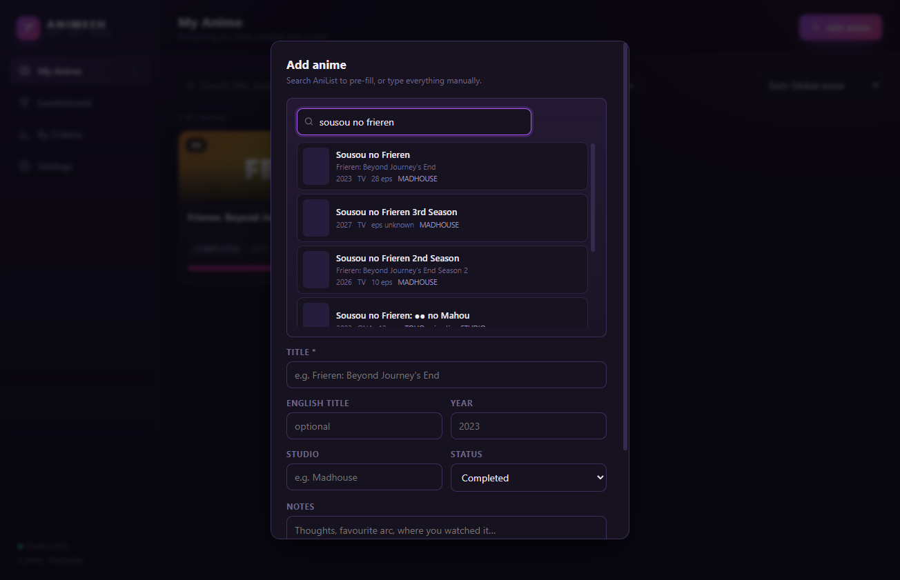
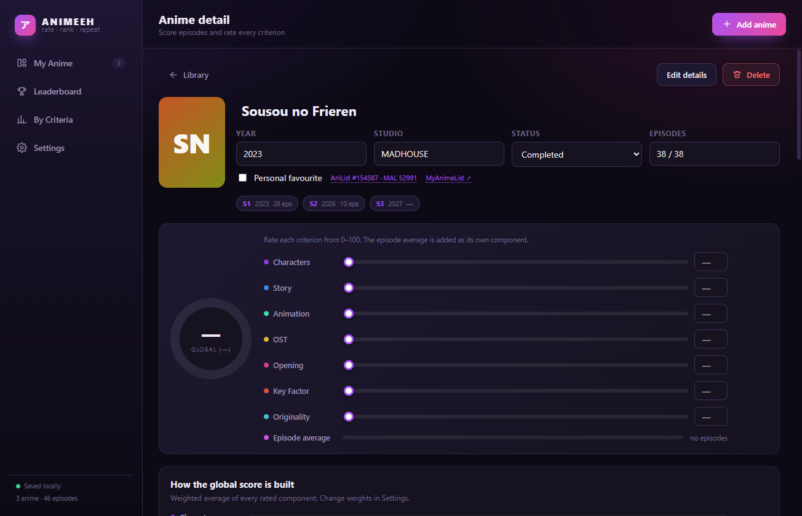
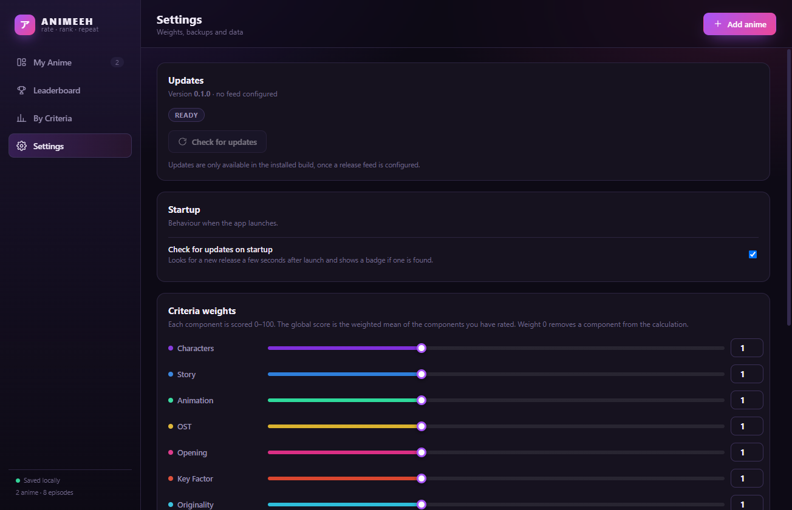
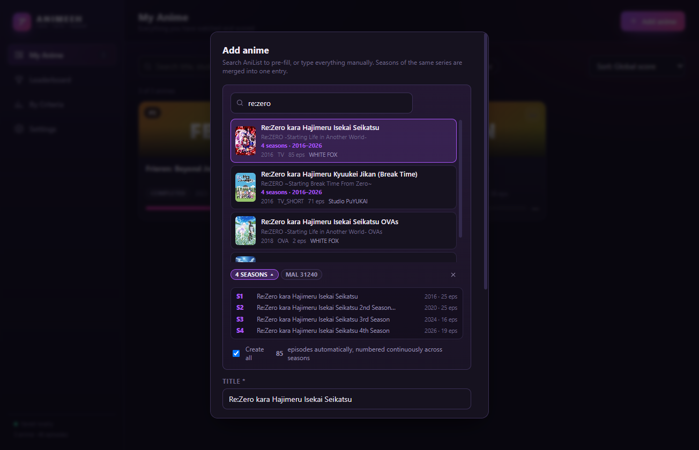

# ANIMEEH

A desktop app to **rate and rank every anime you watch** — episode by episode, across seven criteria, with a weighted global score.

[](https://www.electronjs.org/)
[](https://react.dev/)
[](https://www.typescriptlang.org/)
[](LICENSE)



---

## Contents

- [What it does](#what-it-does)
- [How seasons are merged](#how-seasons-are-merged)
- [The grade palette](#the-grade-palette)
- [How the calendar finds a continuation](#how-the-calendar-finds-a-continuation)
- [When a sequel is not a season](#when-a-sequel-is-not-a-season)
- [Why the find bar has to be sticky](#why-the-find-bar-has-to-be-sticky)
- [The scoring model](#the-scoring-model)
- [Install](#install)
- [Where your data lives](#where-your-data-lives)
- [Available scripts](#available-scripts)
- [Architecture](#architecture)
- [Releasing a new version](#releasing-a-new-version)
- [Known limitations](#known-limitations)

---

## What it does

- **Rate every episode from 0 to 100.** An unrated episode is simply ignored, so you can create a whole season up front and score it as you watch, without skewing your average.
- **Seven criteria per anime** — Characters, Story, Animation, OST, Opening, Key Factor, Originality.
- **Weighted global score**, with the episode average as a first-class component.
- **Seven views**: Anime (series), Films & OVA, Leaderboard, Rankings by criteria, Calendar, Statistics, Settings.
- **Grade colours that carry information.** The seven letter grades share one palette, defined in `src/renderer/src/palette.ts`. Each tier owns a slice of a single gradient, and a slice ends exactly where the next begins, so the badges read as one continuous gradient cut into steps. The tier's colour washes the row and fills the badge, and the letter colour is chosen by contrast rather than assumed dark — the blue and violet slices are intrinsically dark, where a dark letter reached only 2.9:1. See [The grade palette](#the-grade-palette).
- **Find a title in the ranking.** The leaderboard keeps its order and its reader's place: a search there highlights the matching rows in amber and jumps the current match to the middle of the page, rather than filtering the table. `/` puts the focus in the field, Enter and Shift+Enter walk the matches, Escape clears then releases the focus, and accents are ignored, so `pokemon` finds `Pokémon`. Amber rather than the cyan accent on purpose: cyan already means "selected", so a search result has to read as something else.
  The toolbar sticks to the top of the page, which is a fix rather than a flourish — see [Why the find bar has to be sticky](#why-the-find-bar-has-to-be-sticky).
- **Release calendar.** Upcoming episodes of shows you follow, announced continuations of shows you already have, and the season's new shows kept in a separate section so your own tracking stays clean. Announced continuations are found by walking the SEQUEL chain up to four hops, because one hop is not enough — see [How the calendar finds a continuation](#how-the-calendar-finds-a-continuation).
- **Series and everything else are kept apart.** Searching series never returns a film or an OVA. Both live in the Films tab and are ranked there, so a film is never placed against a series; each row is badged `Film` or `OVA`. A film is rated on six criteria rather than seven, since it has no opening sequence, while an OVA keeps all seven and its episodes. Every count follows the same split: the **Anime** badge counts series and the **Films & OVA** badge counts films and OVAs, so a badge always matches the list beside it.
- **AniList lookup**: type a title and the app pre-fills the year, studio, episode count **and the individual episode titles**, all of which you can still edit by hand.
- **Seasons are merged into one entry.** Search "shingeki no kyojin" and you get one row, not seventeen: the app follows AniList's sequel links and creates a single entry holding all six TV seasons, with episodes numbered continuously and tagged by season.
- **Distinct series in one universe stay distinct.** Dragon Ball, Dragon Ball Z, GT, Super and DAIMA are linked as sequels on AniList but are five separate series, and the app keeps them that way — see [When a sequel is not a season](#when-a-sequel-is-not-a-season).
- **In-app updates** via GitHub Releases.
- **Entirely local**: your ratings live in a single JSON file on your machine. No account, no server.

| Library | Detail |
|---|---|
|  |  |

| Global leaderboard | Rankings by criteria |
|---|---|
|  |  |

| AniList lookup (seasons merged) | A multi-season entry |
|---|---|
|  |  |

| Settings |
|---|
|  |

---

## How seasons are merged

Searching a franchise used to return every season as a separate row. Now the app builds **one entity per franchise**:

1. **Search** groups hits by a normalised title. "Sousou no Frieren", "…2nd Season" and "…3rd Season" collapse into a single row showing `3 seasons · 2023–2027`. Punctuation, `Season N`, `Part N`, `Cour N`, `Final Season` and trailing roman numerals are stripped for the comparison, and a `●` in a title is treated as a separator like any other.
2. **Picking** walks AniList's `SEQUEL` / `PREQUEL` links outwards until the chain ends, then sorts the seasons into broadcast order with a topological sort. This catches seasons the search page did not show and does not depend on title matching.
3. **Broadcast parts are folded back into their season.** A season that aired in two cours ("…2nd Season" + "…2nd Season Part 2", "…Season 3" + "…Season 3 Part 2") becomes **one** season whose episode count is the sum of its parts, flagged `2 parts merged`. Re:Zero reports 4 seasons out of 5 AniList entries this way, and Attack on Titan 4 out of 6.
4. **Episodes** are numbered continuously across the chain (season 2 starts where season 1 ended) and each one is tagged with its season, shown as an `S2` badge.

Deliberate choices:



- **Only series formats join a chain** (`TV`, `TV_SHORT`, `ONA`). This is what keeps Attack on Titan's `PREQUEL` link to the *Kuinaki Sentaku* OVA, and Frieren's `SIDE_STORY` link to its *● no Mahou* spin-off, out of the season list. Films and OVAs are separate entries, listed under Films & OVA.
- **Episode titles are only trusted when the count matches the season.** AniList's `streamingEpisodes` mirrors the streaming service, and Crunchyroll reports the whole franchise: Attack on Titan's Seasons 2 and 3 each return Season 1's 25 episodes. Titles whose length disagrees with the season, or which duplicate an earlier season verbatim, are dropped, and those episodes are created with a placeholder title you can fill in.
- **A single-season show is untouched** — same flow as before, one season, one entry.

Verify the assembly against the live API at any time:

```powershell
npm run check:franchise "shingeki no kyojin" "sousou no frieren"
```

## The grade palette

The seven letter grades share one palette, in `src/renderer/src/palette.ts`. Each
tier owns a **slice of a single gradient**, and a slice ends exactly where the next
begins, so the badges read as one continuous gradient cut into steps rather than
seven colours chosen apart. The continuity is structural and cannot break, because
there is only ever one gradient.

Each tier therefore carries a *range* of hue rather than a hue. Two progressions
run together: within a tier the hue sweeps its slice, and between tiers the hue
steps on. The tier's colour washes its row and fills its badge, and the same value
drives the bar under a card and the dot beside a criterion.

Three things are measured rather than eyeballed, by `npm run check:palette`:

| | This palette | The one it replaced |
|---|---|---|
| Worst perceived gap between neighbours (ΔE, CIE76) | **27.7** | 21.5 |
| Ratio of widest to narrowest gap | **2.28×** | 4.73× |
| Worst letter contrast on a badge | **5.0:1** | 3.3:1 ✗ |

The third row is the one that mattered most. 4.5:1 is the threshold for text this
size, and the old palette missed it: the letter is drawn in the page background
colour on every badge, which fails wherever the badge is dark.

### Three corrections worth keeping

**Why the lightness is derived rather than set.** Contrast is a function of
luminance, and the same HSL lightness gives very different luminance at different
hues. The blue end of B's slice is intrinsically dark, and giving it the same
lightness as the rest produced 2.9:1 — worse than the palette being replaced. Each
end of a slice now has its lightness derived so it clears the threshold.

**Why the letter colour is chosen, not assumed.** Those same blue and violet
slices want a light letter while the amber and lime ones want a dark one. The
letter colour is picked by contrast, per tier.

**Why clamping beats holding the luminance flat.** Holding luminance flat across a
slice is tidier on paper and ruins any slice containing yellow: E's identity colour
is bright, and forcing its orange end to the same luminance turned it cream. Only
the ends that would fall under the readable floor are lifted, so E keeps its colour
and B's dark blue end is raised from `#4F3EE5` to `#7D70EC`.

A first version of the comparison page got this wrong in an instructive way: it
measured the flat middle colour of each tier, which is not what a badge paints, so
it reported B as fine while the rendered badge failed. The page now measures both
ends of the gradient, and this is the reason `check:palette` reads the colours back
out of the gradient the app renders instead of recomputing them.

The four palettes that were compared, with their measurements, are recorded in
`design/leaderboard-palette.html`:

```powershell
npm run design:palette      # then open http://127.0.0.1:4182/
npm run preview:palette     # screenshots it in place, on a copy of your library
```

## How the calendar finds a continuation

The calendar read the `SEQUEL` relations of the library's own ids, **one hop**, and
that quietly hid announcements. Made in Abyss: Mezameru Shinpi, a film announced for
23 October 2026, hangs three hops from the ids the library holds:

```
Made in Abyss (S1)  --SEQUEL-->  Fukaki Tamashii no Reimei (2020 film, finished)
                    --SEQUEL-->  Retsujitsu no Ougonkyou (S2, finished)
                    --SEQUEL-->  Mezameru Shinpi (the announced film)
```

Neither intermediate step is itself upcoming, so a walk that stopped at the first
upcoming entry found nothing. The chain is now followed up to **four hops**, and
every reached entry is traversed while only the upcoming ones are announced.

Three related fixes came with it:

- **Relations are filtered to anime.** A `SEQUEL` can point at an adaptation:
  Cyberpunk: Edgerunners MADNESS is a manga, and it was being listed as a
  continuation of an anime.
- **The announcement prefers an entry you own.** When a continuation is reachable
  from several parents, the line reads "after Made in Abyss" in preference to an
  intermediate film the chain happened to pass through.
- **The count went from 7 to 13** announced continuations on a library of 72,
  which is what the one-hop limit had been hiding.

Each hop is cheap after the first, because the frontier shrinks fast: the library's
138 ids lead to 47, then 25, then 10, so the extra hops add two or three batched
requests rather than a proportional cost.

```powershell
npm run check:schedule              # prints the calendar for your own data
npm run diagnose:mia                # why a given entry is or is not reachable
```

## When a sequel is not a season
Following `SEQUEL` links blindly merged **Dragon Ball, Z, GT, Super and DAIMA** into one
entry of 825 episodes across 8 "seasons". They are linked as sequels, but they are five
different series.

Each title is now reduced to a **series signature**, and two entries belong to the same
series exactly when their signatures match. Only decoration is removed, never a name:

1. a subtitle after a colon, when that colon ends a word (`Bleach: Sennen Kessen-hen`) or
   is followed by three characters or fewer (`Tokyo Ghoul:re`) — but not when the colon
   is inside a word, which is what keeps `Re:Zero kara Hajimeru Isekai Seikatsu` intact;
2. a season, part or cour marker and everything after it, so `Sousou no Frieren 2nd
   Season` and `Boku no Hero Academia FINAL SEASON` both reduce to their base;
3. trailing decoration: a year in parentheses, a number, a roman numeral, or a short
   symbol-bearing token such as `√A`.

A **different series is the default**, and a continuation has to be earned by decoration
the signature removes. That direction is the whole point: an earlier version merged
unless *both* remainders were single plain words, so `Dragon Ball Z` merged with
`Dragon Ball Kai (2014)` — a year in parentheses is not a plain word — and from there the
whole family came back.

Two earlier attempts are worth recording, because both looked right and both were wrong:

- comparing **base titles** split 22 legitimate franchises, from Boku no Hero Academia's
  numbered seasons to Tokyo Ghoul's `√A`;
- **normalising before comparing** turned `√A` into the plain word `a`, which then read as
  a distinct series and broke Tokyo Ghoul again.

### Dragon Ball and Naruto cannot be decided by titles

`Z`, `GT`, `Super` and `DAIMA` are real words, so they survive every step above by
design. No title rule can tell `Dragon Ball Z` apart from `Dragon Ball: Some
Subtitle` without also breaking something else.

Naruto has the opposite problem with the same cause. `Naruto: Shippuden` reads as a
subtitle, and the rule treats a subtitle as a continuation — correctly, most of the
time. Bleach's `Sennen Kessen-hen` *is* a subtitle and genuinely continues Bleach, so
merging it is right. Shippuden is a different series. Nothing about the two titles
tells those cases apart, so both answers are stated rather than inferred:

| Series | Ids | Episodes |
|---|---|---|
| Dragon Ball | 223 | 153 |
| Dragon Ball Z | 813 | 291 |
| Dragon Ball GT | 225 | 64 |
| Dragon Ball Super | 21175 | 131 |
| Dragon Ball DAIMA | 170083 | 20 |
| Dragon Ball Kai + its 2014 recut | 6033, 20635 | 166 |
| Naruto | 20 | 220 |
| Naruto: Shippuden | 1735 | 500 |

Ids sharing a group still join; ids in different groups never do. `FRANCHISE_GROUPS`
is the opposite list — pairs that join despite reading as different series
(Steins;Gate and Steins;Gate 0, and Fate/Zero with Fate/stay night, which the
library already stored as one entry before this rule existed).

Note what the title rule does on its own for Naruto, because it explains the bug:
`Naruto Shippuden`, without a colon, is separated; `Naruto: Shippuden`, with one, is
merged. AniList writes the latter, so the merging branch is the one that fired.

`shouldChainLink` is the single function that decides, and both the app and the checks
call it, so they cannot drift apart.

Verify the rule against real pairs — no network, so it is fast enough to run on every
change:

```powershell
npm run check:series
```

To confirm that no franchise in your own library would be split, and that the Dragon Ball
family stays apart:

```powershell
npm run check:guard
```

To assemble each Dragon Ball series separately against the live API:

```powershell
npm run diagnose:dragonball
```

## Why the find bar has to be sticky

The leaderboard toolbar is `position: sticky`, and that is load-bearing rather
than decorative.

Its find field keeps the focus while you type. Chromium scrolls a focused field
back into view as the caret moves, and while that field sat inside the scrolling
area, every keystroke dragged the container back up to the toolbar and undid the
jump that had just been made to the matched row. Searching "lycoris" highlighted
Lycoris Recoil — the row was found — and left the view at the top, 1736px away
from it, on a 56-row ranking. Enter and the step buttons looked dead because the
row they pointed at was never brought on screen.

Sticking the toolbar means the field is always visible, so there is nothing for
the browser to scroll back to. Keeping the search and the scope tabs at hand
while reading a long ranking is a bonus.

Two things about the diagnosis are worth keeping in mind, because both nearly hid
the bug:

- **Pasting a query hid it completely.** `fill()` sets the value in a single
  event and the scroll worked; typing fires one event per character and it did
  not. `smoke:find` therefore types with `pressSequentially` and never pastes.
  Breaking the sticky rule on purpose makes that suite fail 8 checks, which is
  the check that it still guards the bug.
- **`scrollIntoView({ block: 'center' })` is the wrong tool here**, for a reason
  given away by the numbers above: the table wrapper scrolls horizontally, which
  makes it a scrollport, so the browser centres the row inside *that* — where
  there is nothing to scroll — instead of inside the page. The scroll is computed
  against the first ancestor with real vertical overflow instead.

```powershell
npm run diagnose:find "lycoris"
```

That prints the ancestor chain with each element's overflow and scroll height, the
scroll calls the app makes, and how far the matched row ends up from the middle.
`--` is not needed; the query is a plain argument.

---

## Episode names, and how far they can go

Episode titles come from **three services**, tried in order, because no single one covers everything:

| Source | Strength | Weakness |
|---|---|---|
| **Kitsu** | A real per-anime episode list, and maps to AniList ids | Whole seasons can exist without titles (Tokyo Revengers S2-S4, Kaguya-sama S3) |
| **AniList** | The reference used for episode *counts* | No episode list of its own: `streamingEpisodes` mirrors the streamer and repeats the whole franchise on every season |
| **TVMaze** | Fills some gaps Kitsu leaves | Only accepted when its season layout matches this app's exactly |

AniList's own title list is used only when its length matches the part exactly. For Re:Zero it returns the same 16 franchise-wide titles numbered 63–78 on all three early seasons; trusting that would stamp season 3's titles onto season 1.

**Being straight about the limits:** measured over a 25-anime library, about **95%** of episodes get a name. The rest is a genuine gap — for Tokyo Revengers (S2–S4), Kakegurui's second part and Mushoku Tensei, Kitsu returns the episodes with no titles, TVMaze groups the show differently so it is refused, and AniList has nothing. Those episodes keep their number and stay rateable; only the title is missing, and you can type it yourself.

```powershell
npm run check:numbering         # asserts titles land on the right episodes
npm run diagnose:episodes       # reports coverage and gaps for your own data file
npm run inspect "<title>"       # relations and Kitsu coverage for one title
```

---

## The scoring model

This is the heart of the app, so here is exactly how the global score is computed.

### The eight components

Seven criteria you rate yourself, plus one derived component:

| Component | Source |
|---|---|
| Characters, Story, Animation, OST, Opening, Key Factor, Originality | Your rating, 0 to 100 |
| **Episode average** | Computed automatically from your rated episodes |

### The formula

```
global score = Σ (value × weight) / Σ (weight)
```

The sum only covers components that are **actually rated** and whose **weight is greater than zero**.

Two deliberate consequences:

- A criterion you have not rated yet is **excluded** from the calculation instead of counting as a zero, so a half-filled entry is not penalised.
- Setting a weight to `0` removes that component from the ranking entirely without erasing the rating.

Weights are adjustable in **Settings → Criteria weights** (from `0` to `3`, in steps of `0.25`) and default to `1`.

### A worked example

This is a real result from the test suite for *Sousou no Frieren*, with every weight at `1`:

| Characters | Story | Animation | OST | Opening | Key Factor | Originality | Episode average |
|---|---|---|---|---|---|---|---|
| 95 | 96 | 92 | 88 | 90 | 85 | 89 | 95.6 |

```
(95 + 96 + 92 + 88 + 90 + 85 + 89 + 95.6) / 8 = 91.3
```

→ **91.3**, a grade of **S**.

### Letter grades

| Grade | Threshold |
|---|---|
| **S** | 90 and above |
| **A** | 75 – 89.9 |
| **B** | 65 – 74.9 |
| **C** | 50 – 64.9 |
| **D** | 30 – 49.9 |
| **E** | 10 – 29.9 |
| **F** | below 10 |

### The episode average

It only covers episodes that actually carry a rating:

```
average = sum of rated episode scores / number of rated episodes
```

When no episode is rated the component is `null` and drops out of the calculation, leaving the global score defined by the criteria alone.

---

## Install

### From the releases

1. Download `ANIMEEH-x.y.z-setup.exe` from the [Releases](https://github.com/mRNeFF/animeeh/releases) page.
2. Run the installer and pick an install folder.
3. Shortcuts are created on the Desktop and in the Start menu.

The app updates itself from then on: **Settings → Check for updates**.

### From source

Requires **Node.js 22.12 or newer** (Electron 44's minimum) and **Git**.

```powershell
git clone https://github.com/mRNeFF/animeeh.git
cd animeeh
npm install
npm run dev
```

To produce a Windows installer:

```powershell
npm run dist        # NSIS installer in release/
npm run dist:dir    # unpacked build, no installer (faster)
```

---

## Where your data lives

Your ratings are stored in a single JSON file:

```
%APPDATA%\ANIMEEH\animeeh-data.json
```

> **Worth knowing:** when run from source (`npm run dev`) the app uses a separate folder, `%APPDATA%\animeeh`. The two builds therefore do **not** share a list. Copy the file between them if you need to.

To back up or move your list: **Settings → Export backup** (and **Import backup** in the other direction). The **Show data file** button opens the folder directly.

If something goes wrong, **Settings** shows the current version and the data folder, and startup logs are written alongside it.

---

## Available scripts

| Command | Purpose |
|---|---|
| `npm run dev` | Development mode with hot reload |
| `npm run build` | Compile all three processes into `out/` |
| `npm run typecheck` | TypeScript check, no emit |
| `npm run start` | Run the compiled build |
| `npm run dist` | Windows installer (NSIS) into `release/` |
| `npm run dist:dir` | Packaged, non-installable app into `release/win-unpacked/` |
| `npm run icon` | Regenerate `build/icon.ico` and the PNGs |
| `npm run release` | Build **and publish** a GitHub release |
| `npm run smoke` | End-to-end test: full user journey plus screenshots |
| `npm run smoke:offline` | Checks behaviour when AniList is unreachable |
| `npm run smoke:update` | Tests updating against a fake local feed |
| `npm run smoke:update:live` | Tests updating against the real GitHub releases |
| `npm run smoke:films` | Films tab, leaderboard scopes and grade thresholds |
| `npm run smoke:counts` | Sidebar badges, view counts and the footer, in both languages |
| `npm run smoke:find` | Leaderboard find bar: highlighting, centring and accent matching, typed rather than pasted |
| `npm run smoke:stats` | Statistics figures and the film criteria set |
| `npm run smoke:schedule` | Release calendar end to end, against the live API |
| `npm run check:schedule` | Prints the calendar for your own data, with sanity checks |
| `npm run diagnose:mia` | Shows how far a given entry sits from an announced continuation |
| `npm run smoke:bugfix` | Guards the fixed bugs: delete wording, button label, film picking |
| `npm run audit:i18n` | Fails if any user-facing English text bypasses the dictionaries |
| `npm run audit:translations` | Reports values identical in both languages, and English raised in the main process |
| `npm run check:franchise "query"` | Prints how a franchise is grouped and ordered, against the live AniList API |
| `npm run check:search` | Tests the find-bar matching and highlight offsets, offline |
| `npm run check:palette` | Measures the grade palette: contiguity, perceived gaps, letter contrast |
| `npm run preview:palette` | Screenshots the palette in place, on a copy of your library |
| `npm run design:palette` | Serves the palette comparison page |
| `npm run check:numbering` | Asserts episode titles land on the correct episode numbers |
| `npm run check:series` | Tests the "different series or continuation?" rule on real title pairs, offline |
| `npm run check:guard` | Reports which franchises in your library the series rule would split |
| `npm run check:kinds` | Asserts the film search and the series search stay disjoint, against the live API |
| `npm run diagnose:dragonball` | Assembles each Dragon Ball series on its own, against the live API |
| `npm run verify:ids` | Confirms the AniList ids the curated splits are keyed on |
| `npm run diagnose:find "query"` | Prints the scroll layout and how far the matched row sits from the middle |
| `npm run diagnose:ova` | Lists the OVA, SPECIAL and ONA entries attached to the shows in your library |
| `npm run diagnose:episodes` | Reports episode-name coverage and gaps for your data file |
| `npm run inspect "title"` | Shows a title's AniList relations and Kitsu episode coverage |

---

## Architecture

Three Electron processes plus shared types. **All network access lives in the main process**; the UI never talks to the network directly.

```
src/
├── main/                  Main process (Node)
│   ├── index.ts           Window, persistence, IPC
│   ├── anilist.ts         AniList GraphQL client, with cache and timeouts
│   └── updater.ts         electron-updater: check, download, install
├── preload/               Secure IPC bridge (contextBridge)
│   └── index.ts           The API exposed to the UI, nothing more
├── renderer/              UI (React)
│   ├── index.html
│   └── src/
│       ├── components/    Views and reusable components
│       ├── App.tsx        Navigation between the four views
│       ├── scoring.ts     ★ The scoring model (exercised by the smoke tests)
│       ├── store.tsx      Global state plus debounced persistence
│       ├── types.ts       Data model
│       └── useUpdate.ts   Update state on the UI side
└── shared/                Types shared between main and renderer
```

**Stack:** Electron 44 · React 19 · TypeScript 7 · Vite 7 (via `electron-vite`) · `electron-updater`.

### Implementation notes

- **Context isolation, no `nodeIntegration`.** The UI goes through `window.animeeh`, an explicit API exposed by the preload script.
- **Episode scores are nullable.** `null` means unrated, which is what lets the app pre-create episodes without dragging the average to zero.
- **Disk writes are debounced** (350 ms) and skipped when nothing changed.
- **Updates are user-driven** (`autoDownload = false`), and a background check can never clobber an in-flight or finished download.
- **AniList** is the reference source: its API needs no registration and every entry carries `idMal`, the official MyAnimeList identifier.

---

## Releasing a new version

MyAnimeList's own API requires OAuth2, and `electron-updater` needs a `latest.yml` file that `electron-builder` does not generate for the GitHub provider, so `scripts/release.mjs` handles it.

```powershell
# 1. Bump the version
npm version patch     # or minor / major

# 2. Build and publish
npm run release
```

The script builds, creates the GitHub tag and release, generates `latest.yml` (name, size, sha512), then verifies the files are live.

> The repository **must stay public**: `electron-updater` queries GitHub with no authentication, so a private repo would mean shipping a token inside the app.

This requires an authenticated [GitHub CLI](https://cli.github.com/) (`gh auth login`).

---

## Known limitations

- **The installer is not code-signed.** Windows SmartScreen will show "Unknown publisher" on first run for anyone other than you. Fixing that needs a paid code-signing certificate.
- **Windows only for now.** `electron-builder.yml` contains Linux and macOS targets, but neither has been tested.
- **AniList rate-limits to roughly 30 requests per minute.** The app applies a 450 ms debounce and a 30-minute cache, so you will not notice it in normal use.
- **AniList is not MyAnimeList.** They are separate databases linked by `idMal`. Data is very close for well-known series but can diverge (episode counts, studios).
- **Merging seasons is a heuristic plus a graph walk.** The relation walk is authoritative for what is connected, but three things can still surprise you: two genuinely different shows sharing a base title are merged in the search list (picking one still builds only its real chain, so no data is wrong); a season AniList links with a non-`SEQUEL` relation (an OVA-only continuation) stays a separate entry; and a chain is capped at 15 seasons.
- **Episode titles cover fewer seasons than episodes do.** AniList only reports them reliably for the first season of a long franchise, so later seasons are created with placeholder titles. See [How seasons are merged](#how-seasons-are-merged).
- **The interface is in English**, as are all in-app messages.
